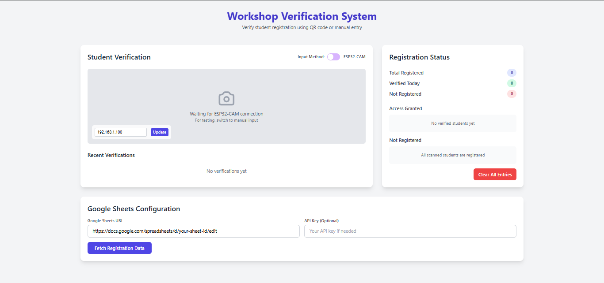

# 🛠️ Workshop Verification System

A smart participant validation system using **ESP32-CAM** and **Google Sheets** that automates verification for workshop attendees via QR code scanning. Designed to be paperless, fast, and reliable.

---

## 📸 Screenshots

> Add these screenshot images inside a `/screenshots` folder in your repo.

---

## 🚀 Features

- ✅ Real-time student verification using roll number QR codes
- 📋 Google Forms integration for easy registration
- 🧾 Google Sheets backend for data storage
- 📷 ESP32-CAM for scanning QR codes
- 🌐 PHP web interface to show registration status
- 🔐 Fast, secure, and paperless

---

---

## 💡 How It Works

1. 📲 Students register via Google Form.
2. 🗃️ Data is stored automatically in Google Sheets.
3. 🧑‍🎓 At the event, students show QR codes (based on roll number).
4. 📷 ESP32-CAM scans the QR code and sends data to PHP server.
5. 🔍 The server queries Google Sheets API to confirm registration.
6. ✅ Displays result on the web interface.

---

## 🛠️ Tech Stack

| Tech | Description |
|------|-------------|
| **ESP32-CAM** | Hardware for scanning QR codes |
| **Google Sheets** | Stores student data from Google Form |
| **Google Apps Script** | Middleware to connect Sheets to PHP |
| **PHP** | Backend for query and response |
| **HTML/CSS** | Frontend for status display |
| **QR Generator** | Any tool (e.g., QRCode Monkey) |

---

## 📦 Setup Instructions

1. **Create a Google Form** with a field for Roll Number.
2. Link it to a **Google Sheet**.
3. Deploy a **Google Apps Script** to expose the data via API.
4. Flash `esp32_cam_qr_code` sketch to ESP32-CAM.
5. Host `webpage/` directory in a PHP-enabled server.
6. Test: scan a QR → show registration status on webpage.

---

## 🔄 Future Enhancements

- ⏱️ Add real-time timestamp logging
- 🔐 Add admin authentication dashboard
- 📱 Build mobile-friendly UI with Bootstrap
- ☁️ Host on Firebase with Firestore integration

---

## 👨‍💻 Author

**Girisudhan V**  
Student at Amrita University  
📧 vagcreations2007@gmail.com  
🌐 [Website](https://vagcreations.unaux.com)

---

## 📄 License

This project is licensed under the MIT License - see the [LICENSE](LICENSE) file for details.

---

## 💫 Support

If you like this project, consider giving it a ⭐ and sharing it with your network!

